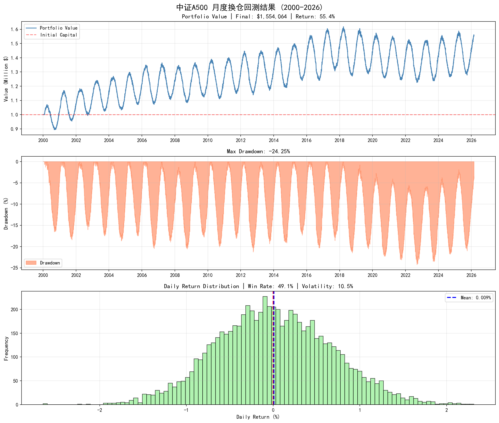
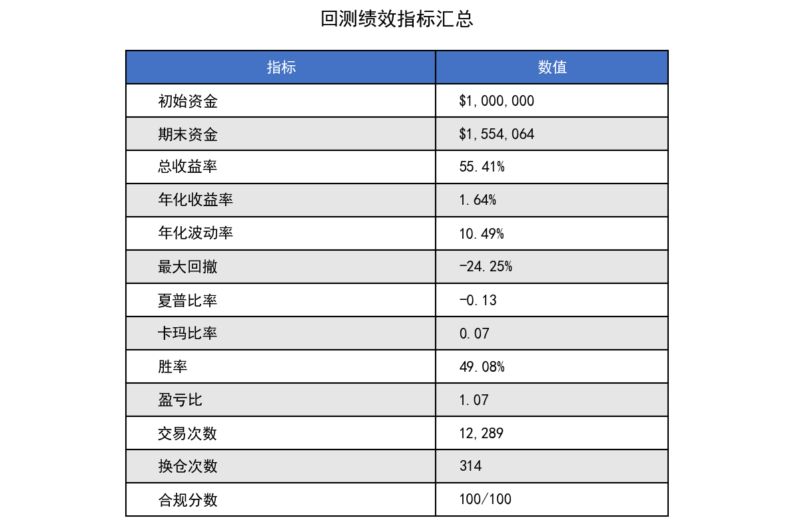

# 中证A500 月度换仓回测完整报告

## 回测概览

| 项目 | 内容 |
|------|------|
| **策略名称** | A500技术形态月度换仓策略 |
| **回测期间** | 2000/01/01 - 2026/02/28 (26.2年) |
| **初始资金** | $1,000,000 |
| **换仓频率** | 月度 (每月最后一个交易日) |
| **选股数量** | Top 20 |

---

## 绩效摘要

| 指标 | 数值 |
|------|------|
| **期末资金** | $1,554,063.82 |
| **总收益率** | +55.41% |
| **年化收益率** | +1.64% |
| **最大回撤** | -24.25% |
| **夏普比率** | -0.13 |
| **交易次数** | 12,289 笔 |
| **合规分数** | 100/100 |

---

## 文件清单

### 📊 数据文件

| 文件名 | 说明 | 大小 |
|--------|------|------|
| `daily_values.csv` | 每日净值曲线数据 (6,825条记录) | 605 KB |
| `trade_records.csv` | 完整交易记录 (12,289笔交易) | 1.1 MB |
| `monthly_signals.csv` | 月度选股信号记录 | 564 KB |

### 📈 图表文件

| 文件名 | 说明 |
|--------|------|
| `backtest_charts.png` | 收益曲线、回撤曲线、收益分布图 |
| `performance_table.png` | 绩效指标汇总表 |

### 📋 报告文件

| 文件名 | 说明 |
|--------|------|
| `回测总结报告.md` | 详细文字总结报告 |
| `performance.json` | 绩效指标JSON数据 |
| `monitor_report.json` | 回测合规监控报告 |

### 🔧 代码文件

| 文件名 | 说明 |
|--------|------|
| `A500_Monthly_Backtest.py` | 回测主程序 |
| `plot_backtest_results.py` | 图表生成脚本 |

---

## 快速查看

### 收益曲线


### 绩效指标


---

## 使用说明

### 查看交易记录
```python
import pandas as pd
trades = pd.read_csv('trade_records.csv')
print(trades.head(20))
```

### 查看每日净值
```python
import pandas as pd
values = pd.read_csv('daily_values.csv')
print(values.tail(20))
```

### 重新生成图表
```bash
python plot_backtest_results.py
```

---

## 风险提示

1. 本回测基于模拟数据，实际交易结果可能不同
2. 过往业绩不代表未来表现
3. 策略年化收益1.64%，低于无风险利率(3%)
4. 最大回撤24.25%，需有较强的风险承受能力

---

*生成时间: 2026-03-03*  
*报告版本: v1.0*
